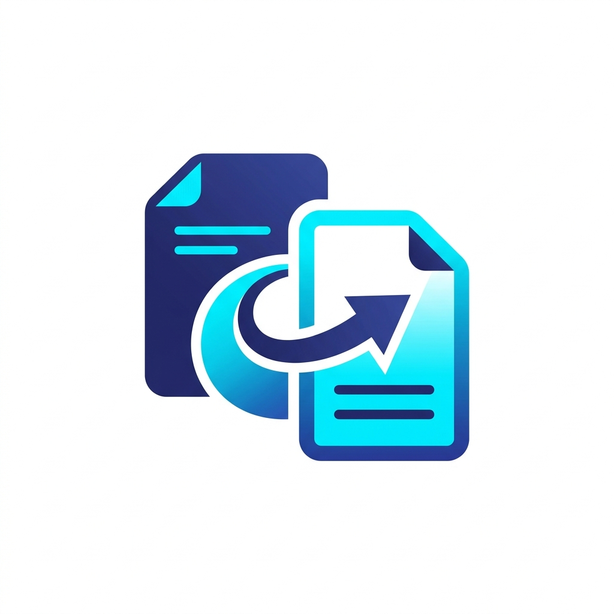

<p align="center">
  
</p>

<h1 align="center">ForChange</h1>

<p align="center">
  <strong>Windows için premium, çift sürümlü medya dönüştürücü — görüntü, video ve ses — Windows Explorer sağ tık menü entegrasyonuyla.</strong>
</p>

<p align="center">
  
  
  
  
  
</p>

<p align="center">
  <a href="README.md">🇬🇧 English</a> &nbsp;|&nbsp; <a href="README.tr.md">🇹🇷 Türkçe</a>
</p>

---

**ForChange**, Windows için son derece modüler, hızlı ve hafif bir **görüntü, video ve ses dönüştürücüdür**. İki farklı sürüm sunar: yerel Windows uygulaması estetiğinde (7-Zip tarzı) **Klasik Win32 Sürümü** ve düzgün animasyonlar ile karanlık/açık tema desteği sunan Wails tabanlı **Modern Sürüm**.

Her iki sürüm de Windows Explorer'a **basamaklı sağ tık menüleri** kaydederek tek tıkla anında dönüşüm yapmanıza olanak tanır — görüntü, video ve ses dosyaları için.

---

## 🌟 Sürümler & Temel Özellikler

### 🏛️ Klasik Win32 Sürümü (`ForChange.exe`)
- **7-Zip Tarzı Yerel Arayüz** — `github.com/lxn/walk` kullanarak ultra hafif Win32 arayüzü
- **Minimalist & Hızlı** — Anında başlatma, ihmal edilebilir RAM kullanımı
- **Tam Medya Desteği** — Tek arayüzden görüntü, video ve ses dönüştürme
- **Entegre Sağ Tık Menüsü** — Kurulumda görüntü, video ve ses için otomatik kaydedilen basamaklı shell menüsü

### 🌌 Modern Wails Sürümü (`ForChangeModern.exe`)
- **Premium Web Arayüzü** — Özel glassmorphism bileşenleriyle şık modern tasarım
- **Zifiri Karanlık Mod** — Parlayan indigo/cyan kenarlıklar ve yumuşak tema geçişleriyle `#000000` arka plan
- **Açık Tema** — Yumuşak, yüksek kontrastlı beyaz ve arduvaz renk şeması
- **Sürükle & Bırak** — Medya dosyalarını doğrudan Explorer'dan uygulamaya sürükleyin
- **Gerçek Zamanlı Toplu İşlem Göstergeleri** — Başarı, beklemede ve hata göstergeleriyle canlı dönüşüm takibi
- **Tam CLI Desteği** — Sessiz sağ tık menüsü dönüşümlerini de destekler

---

## 📊 Desteklenen Formatlar

### 🖼️ Görüntü Formatları

| Format | Oku | Yaz | Notlar |
| :--- | :---: | :---: | :--- |
| **PNG** | ✅ | ✅ | Standart kayıpsız kodlama |
| **JPEG / JPG** | ✅ | ✅ | Kalite kaydırıcısı (1–100) |
| **GIF** | ✅ | ✅ | 256 renkli palet kodlama |
| **BMP** | ✅ | ✅ | Sıkıştırılmamış bitmap |
| **TIFF / TIF** | ✅ | ✅ | Deflate sıkıştırma |
| **WEBP** | ✅ | ❌ | Yalnızca okuma (pure Go) |
| **ICO** | ✅ | ✅ | Otomatik boyutlandırma, max 256×256 px |

### 🎬 Video Formatları

| Format | Oku | Yaz | Notlar |
| :--- | :---: | :---: | :--- |
| **MP4** | ✅ | ✅ | H.264, geniş uyumluluk |
| **MKV** | ✅ | ✅ | Matroska container |
| **AVI** | ✅ | ✅ | Eski format desteği |
| **MOV** | ✅ | ✅ | Apple QuickTime |
| **WEBM** | ✅ | ✅ | VP8/VP9, web optimizasyonlu |
| **GIF** (videodan) | ✅ | ✅ | Animasyonlu GIF çıkarma |
| **MP3** (videodan) | ✅ | ✅ | Videodan ses çıkarma |

### 🔊 Ses Formatları

| Format | Oku | Yaz | Notlar |
| :--- | :---: | :---: | :--- |
| **MP3** | ✅ | ✅ | Kayıplı, evrensel oynatma |
| **WAV** | ✅ | ✅ | Sıkıştırılmamış PCM |
| **M4A** | ✅ | ✅ | MPEG-4 içinde AAC |
| **FLAC** | ✅ | ✅ | Kayıpsız ses |
| **AAC** | ✅ | ✅ | Gelişmiş Ses Kodlama |
| **OGG** | ✅ | ✅ | Vorbis codec |

---

## 🖱️ Sağ Tık Menü Entegrasyonu

ForChange'in öne çıkan özelliklerinden biri derin Windows Explorer entegrasyonudur. Kurulumun ardından **desteklenen herhangi bir dosyaya sağ tıklandığında** uygulamayı manuel açmadan tek tıkla dönüştürme seçenekleri sunan **"ForChange Converter"** alt menüsü görüntülenir.

### Nasıl Çalışır?

Yükleyici, Windows Registry'de `Software\Classes\SystemFileAssociations` altına shell girdileri kaydeder. Bu yaklaşım, VLC veya Windows Media Player gibi diğer uygulamaların mevcut dosya ilişkilerini **bozmayan** doğru ve güvenli Windows yöntemidir.

### Menü Kapsamı

| Dosya Türü | Uzantılar | Alt Menü Seçenekleri |
| :--- | :--- | :--- |
| **Görüntü** | Tüm görüntü dosyaları | PNG, JPG, BMP, GIF, ICO'ya Dönüştür, GUI ile Dönüştür... |
| **Video** | `.mp4` `.mkv` `.avi` `.mov` `.webm` | MP4, WEBM, MKV, MP3 (Ses), GIF'e Dönüştür, GUI ile Dönüştür... |
| **Ses** | Tüm ses dosyaları | MP3, WAV, M4A, FLAC'a Dönüştür, GUI ile Dönüştür... |

> **Teknik not:** Video uzantıları maksimum uyumluluk için **iki** ayrı registry girişi alır:
> - `SystemFileAssociations\video\shell\` — PerceivedType tabanlı, tüm video dosyalarını genel olarak kapsar
> - `SystemFileAssociations\.mp4\shell\` (uzantı bazlı) — `.mp4` ilişkisine hangi uygulamanın sahip olduğundan bağımsız olarak çalışır

---

## 🛠️ Kurulum & Derleme

### Gereksinimler
- [Go (Golang)](https://go.dev/) 1.23 veya üstü
- [Node.js](https://nodejs.org/) & `npm` *(Yalnızca Modern sürüm için)*
- [Wails CLI](https://wails.io/docs/gettingstarted/installation) *(Yalnızca Modern sürüm için)*
- [Inno Setup 6](https://jrsoftware.org/isinfo.php) *(Yükleyici oluşturmak için)*

### Derleme Adımları

1. **Repoyu klonlayın:**
   ```bash
   git clone https://github.com/tommyvercetti89/ForChange.git
   cd ForChange
   ```

2. **Klasik Sürümü Derleyin:**
   ```bash
   # Kaynakları yeniden oluşturun (manifest ve ikon)
   rsrc -manifest main.manifest -ico assets/logo.ico -o rsrc.syso

   # Çalıştırılabilir dosyayı derleyin
   go build -ldflags="-s -w -H windowsgui" -o ForChange.exe .
   ```

3. **Modern Sürümü Derleyin:**
   ```bash
   cd modern
   wails build -platform windows/amd64 -o ForChangeModern.exe
   cd ..

   # Binary'yi kök klasöre kopyalayın
   Copy-Item "modern\build\bin\ForChangeModern.exe" -Destination "ForChangeModern.exe" -Force
   ```

4. **Yükleyicileri Oluşturun** *(Inno Setup 6 gerekir)*:
   ```bash
   # Klasik yükleyici
   & "C:\Program Files (x86)\Inno Setup 6\ISCC.exe" setup.iss

   # Modern yükleyici
   & "C:\Program Files (x86)\Inno Setup 6\ISCC.exe" setup_modern.iss
   ```

   Yükleyiciler `dist/` klasörüne yerleştirilir:
   - `dist/QBSoft_ForChange_Setup.exe`
   - `dist/QBSoft_ForChangeModern_Setup.exe`

---

## 💻 Kullanım

### 🎨 Grafik Mod (GUI)
GUI'yi başlatmak için `ForChange.exe` veya `ForChangeModern.exe`'yi herhangi bir bayrak olmadan çalıştırın.

- **Dosya Ekle** — Sürükle & bırak veya dosya seçici kullanın
- **Hedef Konum** — Kaynak dosyanın yanına kaydet veya özel çıktı dizini seç
- **ICO Boyutu** — ICO formatı hedeflendiğinde Kalite alanı boyut seçiciye dönüşür (16–256 px)

### 💻 Komut Satırı Modu (CLI)
Her iki binary de başsız CLI kullanımını destekler:

```bash
# Görüntüyü PNG'ye dönüştür
ForChange.exe -i fotograf.jpg -f png

# Görüntüyü %90 kaliteyle JPG'ye dönüştür
ForChange.exe -i fotograf.png -o cikti.jpg -f jpg -q 90

# Görüntüyü 128px Windows ikonuna dönüştür
ForChange.exe -i logo.png -o logo.ico -f ico -q 128

# Videoyu MP4'e dönüştür
ForChange.exe -i video.mkv -f mp4

# Videoyu WEBM'e dönüştür
ForChange.exe -i video.mp4 -f webm

# Videodan MP3 olarak ses çıkar
ForChange.exe -i video.mp4 -f mp3

# Sesi FLAC'a dönüştür
ForChange.exe -i muzik.mp3 -f flac

# Sesi WAV'a dönüştür
ForChange.exe -i podcast.m4a -f wav
```

#### Kullanılabilir CLI Bayrakları

| Bayrak | Açıklama | Zorunlu |
| :--- | :--- | :---: |
| `-i` | Girdi dosya yolu | ✅ |
| `-o` | Çıktı dosya yolu | ❌ |
| `-f` | Hedef format (yukarıdaki tablolara bakın) | ✅ |
| `-q` | Kalite `1–100` (JPEG) veya boyut `16–256` (ICO) | ❌ |

---

## 📁 Proje Yapısı

```
ForChange/
├── main.go                  # Giriş noktası — CLI yönlendirme & GUI yedek
├── cli/
│   └── cli.go               # Başsız dönüşüm mantığı
├── converter/
│   ├── converter.go         # Görüntü dönüşüm motoru
│   ├── media.go             # Video & ses dönüşümü (FFmpeg wrapper)
│   └── ffmpeg_embed.go      # Gömülü FFmpeg binary
├── gui/
│   └── gui.go               # Klasik Win32 GUI (Walk)
├── modern/
│   ├── main.go              # Wails uygulama giriş noktası
│   ├── app.go               # Go backend bağlamaları
│   └── frontend/            # Web arayüzü (HTML/CSS/JS)
├── assets/                  # İkonlar ve görseller
├── setup.iss                # Inno Setup scripti — Klasik sürüm
├── setup_modern.iss         # Inno Setup scripti — Modern sürüm
└── dist/                    # Oluşturulan yükleyiciler (git-ignored)
```

---

## 📋 Değişiklik Geçmişi

### Son Değişiklikler
- **Video sağ tık menüsü düzeltildi** — `.mp4`, `.mkv`, `.avi`, `.mov`, `.webm` dosyalarına sağ tıklandığında artık **ForChange Converter** alt menüsü Windows Explorer'da doğru şekilde görünüyor. Daha önce kullanılan `.ext\shell\` registry yolu diğer uygulamalar tarafından geçersiz kılınıyordu; şimdi doğru `SystemFileAssociations\.ext\shell\` yaklaşımı kullanılıyor.
- **Tam video format desteği** — Gömülü FFmpeg aracılığıyla MP4, MKV, AVI, MOV, WEBM dönüşümü eklendi
- **Videodan ses çıkarma** — Herhangi bir video dosyasını doğrudan MP3'e dönüştür
- **Videodan animasyonlu GIF** — Video kliplerini animasyonlu GIF olarak çıkar ve dönüştür
- **Ses dönüşümü** — MP3 ↔ WAV ↔ M4A ↔ FLAC ↔ AAC ↔ OGG

---

## 🤝 İş Birliği & Katkılar
Bu proje, **tommyvercetti89** tarafından Google DeepMind ekibinin tasarladığı güçlü bir ajansal yapay zeka kodlama asistanı olan **Antigravity** ile çift programlama iş birliğiyle geliştirilmiştir.

---

## ⚖️ Lisans
MIT Lisansı kapsamında dağıtılmaktadır. Daha fazla ayrıntı için `LICENSE` dosyasına bakın.
